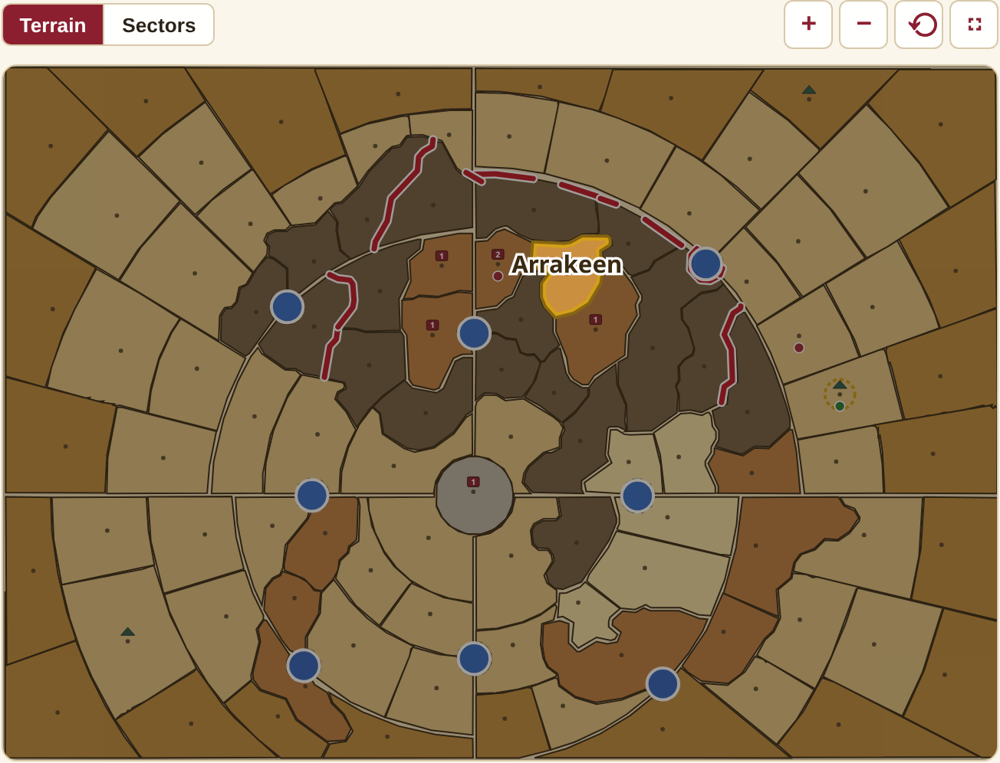
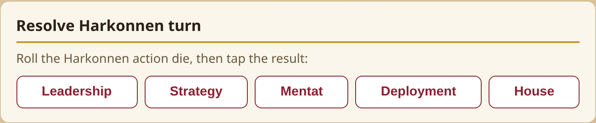
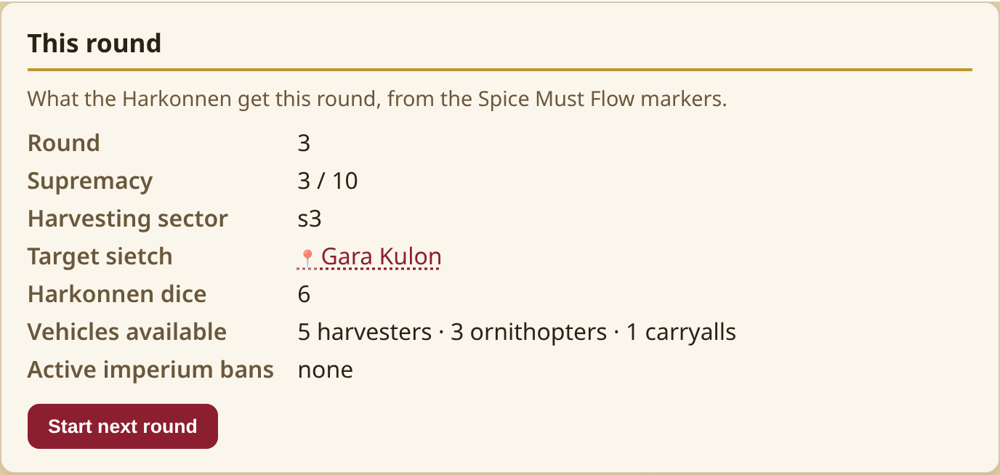
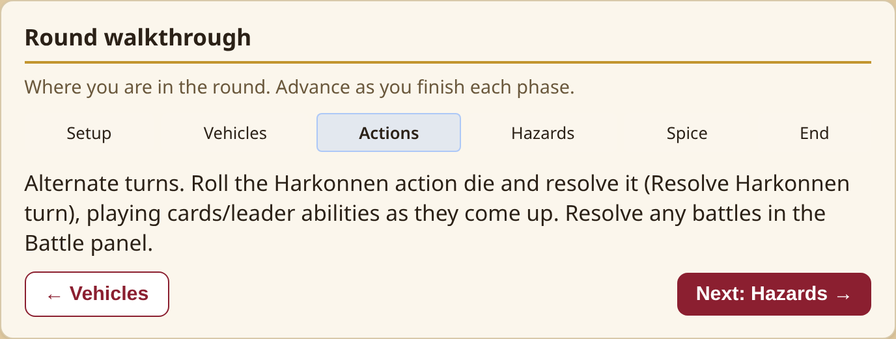
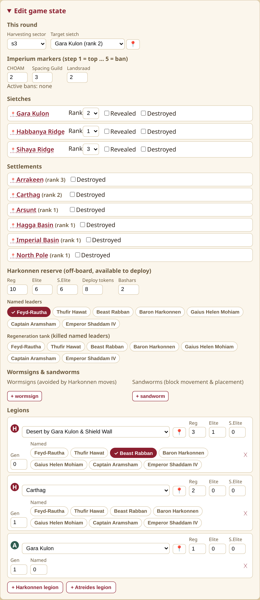
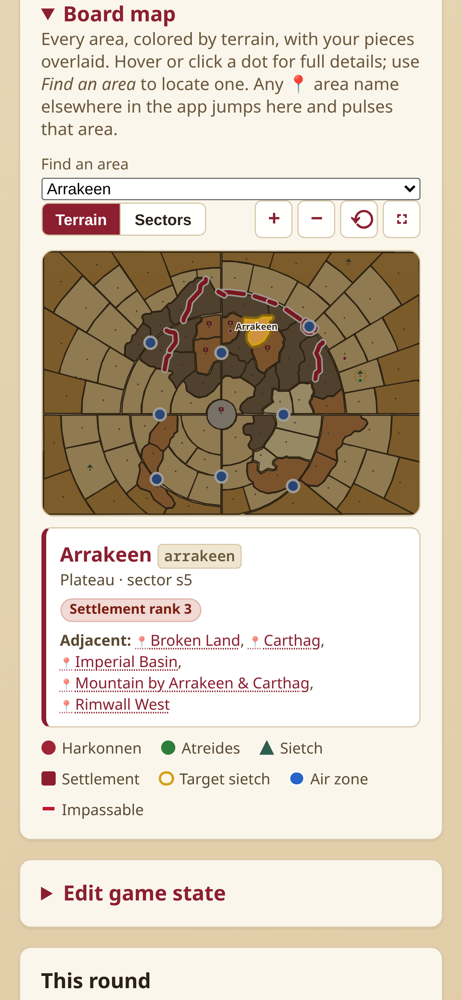

# Dune: War for Arrakis — Mahdi Solo Companion

A web app that plays the **Harkonnen "AI"** for you in the **Mahdi solo mode** of the board game
*Dune: War for Arrakis*.

In Mahdi solo you run the Atreides on the physical board and must manually execute the Harkonnen
side — nested priority lists for action‑die resolution, shortest‑path movement, combat, deployment,
desert hazards and the economy. This app automates all of that: keep it in sync with your table and,
on the Harkonnen's turn, it tells you exactly what they do. **The physical board stays the source of
truth; the app is the co‑processor.**

🎲 **Live app:** https://dune-war-for-arrakis.kdc.sh

> Fan‑made companion for solo play. Not affiliated with or endorsed by the publisher; contains no
> game art or rules text — just the state the AI needs to make its decisions.

---

## Screenshots

### Interactive board map
Every one of the 101 areas, drawn as its real traced shape and colored by terrain (impassable walls
and air zones included), with your pieces overlaid (legions, sietches, settlements, the target‑sietch
halo, wormsigns). Hover or tap a dot for full details, or use **Find an area** to locate one — any
area or air‑zone name elsewhere in the app jumps here and pulses it. Pinch‑zoom & pan on touch.



### Run the Harkonnen turn
Roll the physical action die, tap the face, and the app gives a plain‑English directive — applying
the mechanical ones for you and leaving dice‑driven ones (attacks) to resolve on the board.



### Round walkthrough & status
A phase tracker that guides you step‑by‑step through the round, alongside what the Harkonnen get this
round from the Spice Must Flow markers.




### Game‑state editor
Match the app to your table: imperium markers, legions (with a 📍 "set on the map" picker), sietch/
settlement ranks, the Harkonnen reserve, wormsigns & sandworms.



### Works on a phone
Responsive layout; the board map supports pinch‑zoom and pan so dots stay tappable.



---

## Features

- **Full Harkonnen decision engine** — action‑die resolution (Leadership/Strategy/Mentat/Deployment/
  House) via the solo priority cascade, shortest‑path movement, the "cease attack" rule, deployment,
  vehicle placement, and planning‑card / named‑leader special abilities.
- **Round‑by‑round battle resolver** — enter each round's physical dice; the app reveals deployment
  tokens to units at the start of the battle, then applies the Harkonnen casualty priority, leader
  combat abilities, reinforcement spending, reserve replenishment, and destroys a taken sietch.
- **Desert Hazards** — official wormsign placement (terrain + occupancy rules) and Coriolis storm
  resolution.
- **Spice Must Flow** — imperium markers drive action‑dice and vehicle availability and the bans;
  a harvesting panel previews and applies the solo spice allocation, completing the round in‑app.
- **Interactive board map** — all 101 areas drawn as their real traced shapes, colored by terrain
  (or by sector), with impassable walls, air zones, and your whole game state overlaid. Locate any
  area or air zone from anywhere in the app — names everywhere are clickable and pulse the map. It
  also doubles as an area picker for the editor, with pinch‑zoom, pan, and a full‑window view.
- **Persistence** — auto‑save to the browser, multiple named saves, plus JSON export/import.
- **Built to be trustworthy** — a headless, pure‑TypeScript engine covered by **238 tests**.

## How it works

You play **Atreides** on the table. The app models the board state the AI rules need, then on the
Harkonnen turn it reads that state and decides their action. You keep the app and the board in sync
via the **Edit game state** panel (or the 📍 map picker), and the **Round walkthrough** guides you
through each phase.

## Getting started

```bash
npm install
npm run dev        # local dev server (http://localhost:5173)
```

Other scripts:

```bash
npm run build      # type-check + production build to dist/
npm run preview    # serve the production build
npm test           # run the engine test suite (vitest)
npm run typecheck  # tsc --noEmit
```

## Tech & layout

- **React 18 + TypeScript + Vite.** No UI framework dependencies beyond React.
- `src/engine/` — the **headless, pure‑TS rules engine** (no React import); every rule is unit‑tested.
- `src/ui/` — the React UI layer that renders engine output and edits state.
- `src/engine/board.ts` & `boardPositions.ts` — the 101‑area board graph and map coordinates
  (generated; see `scripts/`).

## Deployment & releases

- **Continuous deploy:** every push to `main` runs `.github/workflows/deploy.yml` (type‑check →
  tests → build → publish `dist/` to GitHub Pages at **https://dune-war-for-arrakis.kdc.sh**). The
  custom domain is pinned by `public/CNAME`, which Vite copies into every build.
- **Versioned releases:** pushing a `vX.Y.Z` tag runs `.github/workflows/release.yml`, which builds,
  tests, and publishes a GitHub Release with auto‑generated notes and a zipped `dist/`. See
  [RELEASING.md](RELEASING.md) for the one‑command flow, and [CHANGELOG.md](CHANGELOG.md) for history.

## Contributing

Contributions welcome — see [CONTRIBUTING.md](CONTRIBUTING.md) for the project layout, dev setup,
and conventions (game rules live in the tested pure‑TS engine; the UI stays rules‑free).

## Status

The Mahdi‑solo engine and UI are feature‑complete and shipped. See `PLAN.md` for the roadmap.
